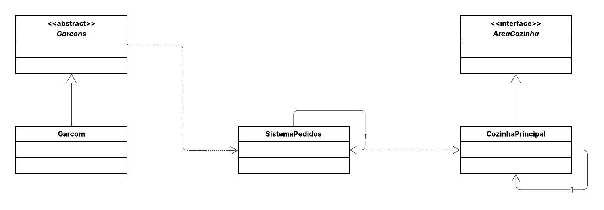

## 🍽️ Gerenciamento de Pedidos (Restaurante)

Este projeto implementa o Padrão de Projeto Comportamental Mediator (Mediador).

O objetivo é centralizar a comunicação entre diferentes partes do restaurante (Garçons e Cozinha) através de um único objeto coordenador: o SistemaPedidos.
-----

## 📌 Diagrama de Classes

-----

## 👩‍💻 Autora

**Eduarda Araujo Carvalho**
